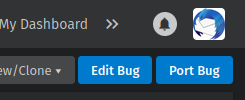
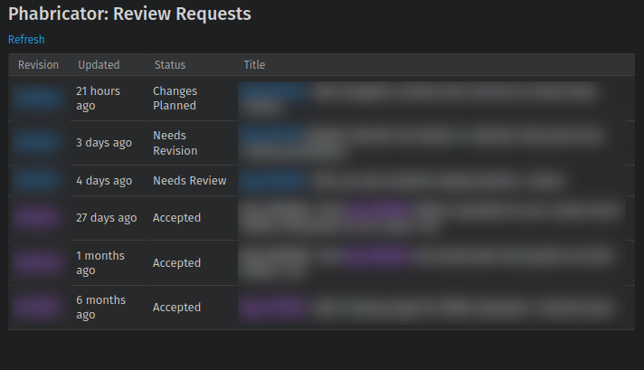

# Thunderbird Bug Porter

> Webextension that adds a button to BMO to help create "Port bugs" for
> Thunderbird developers.

**Note: This extension is really only useful to people actively working on
Thunderbird development.**

## Description

It adds a "Port Bug" button to BMO. You must be logged in for this to work.
I've only tested with my account which has "edit-bugs" permissions.



Clicking "Port Bug" will open a new tab (probably) that pre-populates some
fields. The new bug is a "port bug". These are bugs created when changes in
mozilla-central code need an equivalent change in comm-central.

Currently, these fields are set:

- Product: Thunderbird
- Component: Upstream Synchronization
- Summary: The summary of the original bug with "Port bug ORIG_BUGNUM:" prepended
- Bug Type: Set to the bug type of the original
- See Also: Set to original bug number

## Phabricator In Bugzilla

Displays Review requests from Phabricator in Bugzilla Dashboard. A Phabricator
API key needs to be set in Options for this to work.




## Install


## Build Setup

``` bash
# install dependencies
yarn install

# Test in Firefox (via web-ext run)
yarn run dev

# build for production
yarn run build

# Run source linting
yarn run lint
```
